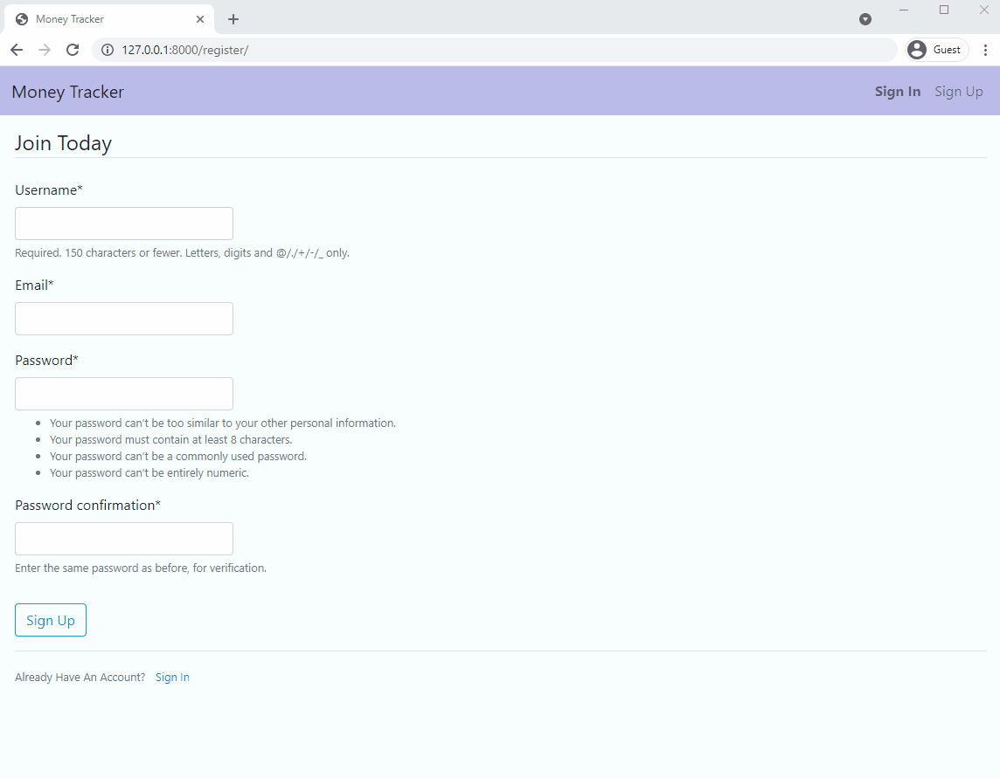

# django-budget
> A web application that allows users to track expenses. Utilized HTML, CSS & JavaScript on the front end, Django on the backend



## Installation

Windows:

```sh
> pip install -r requirements.txt
```

## Starting Server

```sh
> python manage.py runserver

open web browser to [http://127.0.0.1:8000/](http://127.0.0.1:8000/)
```
